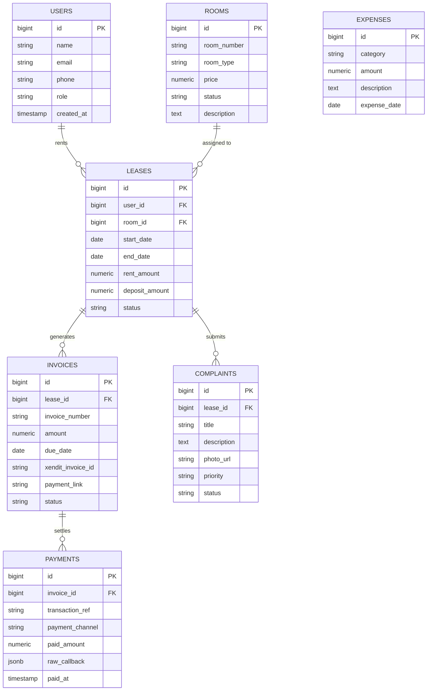

# Product Requirement Document (PRD)
## Sistem Informasi Pengelolaan Kos (SIM-Kos)

---

## 1. Ringkasan Eksekutif & Tujuan Produk
Aplikasi berbasis web responsif (*mobile-friendly*) untuk membantu pemilik kos (Ibu Kos) mengelola operasional properti secara transparan dan terotomasi. Sistem ini menggantikan pencatatan manual dan pengecekan transfer bank manual melalui integrasi payment gateway (Xendit), penanganan pengaduan kerusakan kamar, serta rekapitulasi arus kas bersih.

---

## 2. Tech Stack & Infrastruktur
- **Backend:** Laravel 12 (PHP 8.3+)
- **Frontend:** React 18+ (Inertia.js stack untuk efisiensi full-stack monolitik modern) + Tailwind CSS
- **Database:** PostgreSQL 15+ (memanfaatkan tipe data JSONB & constraint relasional ketat)
- **Containerization:** Docker & Docker Compose (Laravel backend, PostgreSQL, Nginx, Redis)
- **Third-Party Services:**
  - Payment Gateway: Xendit API (Invoices / XenInvoice API)
  - Mail Provider: Resend / Mailtrap SMTP (notifikasi email)
  - Messaging: WhatsApp Gateway API (direncanakan di tahap lanjutan; fallback: WhatsApp click-to-chat)

---

## 3. Fitur Utama & Ruang Lingkup

### 3.1. Modul Manajemen Kamar & Properti
- Pengelolaan master kamar: nomor kamar, tipe kamar, harga sewa dasar, status (`available`, `occupied`, `maintenance`).
- Fasilitas kamar dan foto inventaris awal (*check-in condition*).

### 3.2. Modul Penghuni & Kontrak Sewa
- Profil penyewa: nama, nomor WhatsApp, nomor KTP/identitas, kontak darurat.
- Kontrak sewa (*lease agreements*): tanggal mulai, durasi/siklus penagihan (bulanan/tahunan), nilai sewa yang disepakati, serta pencatatan nominal deposit/uang jaminan awal.
- *Checkout workflow*: kalkulasi otomatis pengembalian deposit (Deposit Awal - Kerusakan - Tunggakan).

### 3.3. Modul Billing, Invoicing, & Payment Gateway (Xendit)
- Task Scheduler Laravel harian untuk memeriksa tagihan jatuh tempo dan membuat invoice baru secara otomatis.
- Integrasi Xendit Checkout Invoice:
  - Generasi tautan pembayaran (QRIS, E-Wallet, Virtual Account Bank).
  - Webhook listener untuk menerima callback status `PAID` atau `EXPIRED`.
  - Verifikasi callback token untuk keamanan webhook.
- Notifikasi email otomatis kepada pemilik kos saat pembayaran berhasil terkonfirmasi.

### 3.4. Modul Tiket Komplain & Pengaduan Fasilitas
- Form pelaporan kerusakan oleh penyewa: judul kendala, deskripsi, foto bukti.
- Status progres penanganan: `open`, `in_progress`, `resolved`.
- Fallback notifikasi pemilik: Tombol interaktif langsung mengarah ke tautan `wa.me` pemilik kos dengan template teks yang terisi otomatis (sembari menunggu WhatsApp API resmi).

### 3.5. Modul Pengeluaran & Ringkasan Finansial
- Input pengeluaran operasional kos (listrik umum, internet, kebersihan/sampah, perbaikan tukang).
- Dashboard analitik ringkas:
  - Total kamar terisi vs kosong.
  - Pendapatan sewa masuk vs pengeluaran operasional.
  - Laba bersih bulanan.
  - Export laporan bulanan ke format Excel/PDF.

---

## 4. Arsitektur Diagram

### 4.1. Entity Relationship Diagram (ERD)

